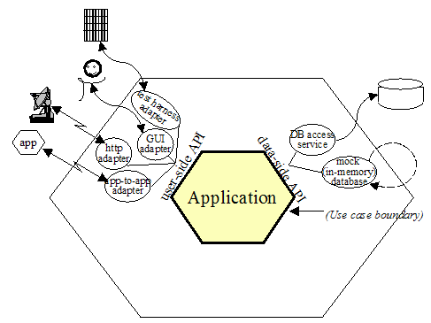
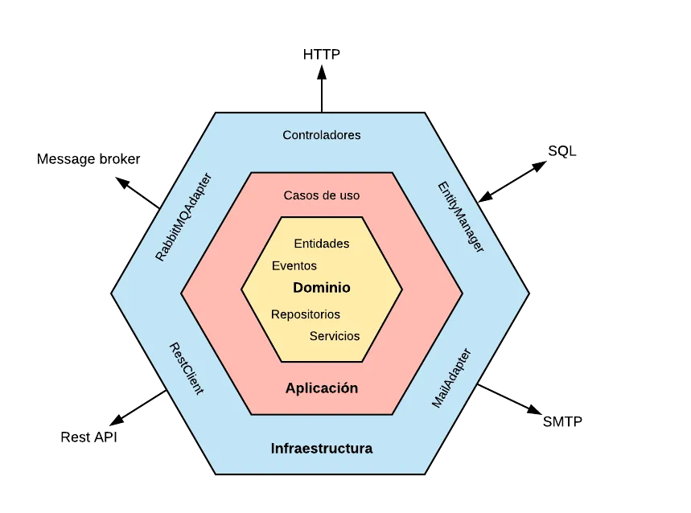

# Enunciado

En la base de datos de comercio electrónico de la compañía disponemos de la tabla PRICES que refleja el precio final (pvp) y la tarifa que aplica a un producto de una cadena entre unas fechas determinadas. A continuación se muestra un ejemplo de la tabla con los campos relevantes:
 
## PRICES

 BRAND_ID | START_DATE            | END_DATE              | PRICE_LIST | PRODUCT_ID | PRIORITY | PRICE | CURR
---------|-----------------------|-----------------------|------------|------------|----------|-------|-----
1        | 2020-06-14-00.00.00   | 2020-12-31-23.59.59   | 1          | 35455      | 0        | 35.50 | EUR 
1        | 2020-06-14-15.00.00   | 2020-06-14-18.30.00   | 2          | 35455      | 1        | 25.45 | EUR 
1        | 2020-06-15-00.00.00   | 2020-06-15-11.00.00   | 3          | 35455      | 1        | 30.50 | EUR 
1        | 2020-06-15-16.00.00   | 2020-12-31-23.59.59   | 4          | 35455      | 1        | 38.95 | EUR 

## Campos: 
 
- BRAND_ID: foreign key de la cadena del grupo (1 = ZARA). 
- START_DATE:, END_DATE: rango de fechas en el que aplica el precio tarifa indicado.
- PRICE_LIST: Identificador de la tarifa de precios aplicable.
- PRODUCT_ID: Identificador código de producto.
- PRIORITY: Desambiguador de aplicación de precios. Si dos tarifas coinciden en un rago de fechas se aplica la de mayor prioridad (mayor valor numérico).
- PRICE: precio final de venta.
- CURR: iso de la moneda.
 
## Se pide:
 
Construir una aplicación/servicio en SpringBoot que provea una end point rest de consulta  tal que:
 
Acepte como parámetros de entrada: fecha de aplicación, identificador de producto, identificador de cadena.
Devuelva como datos de salida: identificador de producto, identificador de cadena, tarifa a aplicar, fechas de aplicación y precio final a aplicar.
 
Se debe utilizar una base de datos en memoria (tipo h2) e inicializar con los datos del ejemplo, (se pueden cambiar el nombre de los campos y añadir otros nuevos si se quiere, elegir el tipo de dato que se considere adecuado para los mismos).
              
Desarrollar unos test al endpoint rest que validen las siguientes peticiones al servicio con los datos del ejemplo:
                                                                                       
-          Test 1: petición a las 10:00 del día 14 del producto 35455   para la brand 1 (ZARA)
-          Test 2: petición a las 16:00 del día 14 del producto 35455   para la brand 1 (ZARA)
-          Test 3: petición a las 21:00 del día 14 del producto 35455   para la brand 1 (ZARA)
-          Test 4: petición a las 10:00 del día 15 del producto 35455   para la brand 1 (ZARA)
-          Test 5: petición a las 21:00 del día 16 del producto 35455   para la brand 1 (ZARA)
 
 
Se valorará:
 
- Diseño y construcción del servicio.
- Calidad de Código.
- Resultados correctos en los test.

# Price Microservice

## Arquitectura

- Este proyecto utiliza la arquitectura hexagonal definida por [Alistair Cockburn](https://alistair.cockburn.us/hexagonal-architecture/), también conocida como Ports and Adapters.



- Nuestra implementación incluye una capa de dominio adicional, como se explica en este artículo de [Edu Salguero](https://medium.com/@edusalguero/arquitectura-hexagonal-59834bb44b7f).



## Estructura del Proyecto
El proyecto está organizado en tres capas principales:

- Infrastructure (Infraestructura): Maneja la interacción con componentes externos, como bases de datos y servicios de terceros.
- Domain (Dominio): Contiene la lógica de negocio central del sistema, independiente de detalles técnicos.
- Application (Aplicación): Gestiona la coordinación de las operaciones del sistema, asegurando que los componentes de infraestructura y dominio colaboren correctamente.

```text
java/
└── com.example.price_test
    ├── application
    │   └── usecase
    │       └── PriceUseCase.java
    ├── domain
    │   ├── exception
    │   │   └── NotFoundPriceCriteria.java
    │   ├── model
    │   │   └── Price.java
    │   └── repository
    │       └── PriceRepository.java
    ├── infrastructure
    │   ├── api
    │   │   ├── controller
    │   │   │   └── PriceController.java
    │   │   ├── handler
    │   │   │   └── ExceptionHandlerController.java
    │   │   └── mapper
    │   │       └── PriceApiMapper.java
    │   └── db
    │       ├── configuration
    │       │   └── RepositoryConfiguration.java    
    │       ├── entity
    │       │   └── PriceEntity.java
    │       │── mapper
    │       │   └── PriceDbMapper.java
    │       └── repository
    │           ├── PriceRepositoryImpl.java
    │           └── PriceRepositoryJpa.java
    └── PriceTestApplication.java
resources/
└── db.changelog
    └─── databaseChangeLog.yaml
    └─── migrations
         └─── 1-create_table_prices.sql
         └─── 2-insert_table_prices.sql
└── static
└── templates
└── application.yaml
└── application-test.yaml
└── OpenAPI.yaml
```
## Buenas Prácticas y Herramientas

Además de la arquitectura hexagonal, seguimos varias buenas prácticas y utilizamos herramientas para asegurar la calidad del proyecto:

- **Código Limpio (Clean Code)**: Adoptamos principios de diseño de software para mantener el código legible y mantenible.
- **Patrones de Diseño SOLID**: Aplicamos los principios SOLID para una arquitectura más robusta y flexible.
- **ApiFirst**: Desarrollamos la API antes del código para asegurar que la interfaz de la API esté bien definida y documentada.
- **Documentación con Swagger**: Utilizamos Swagger para generar y mantener la documentación de la API.
- **Cobertura de Tests con Jacoco**: Implementamos Jacoco para monitorear la cobertura de los tests, garantizando que el código esté adecuadamente probado.
- **Control de Versiones de Base de Datos con Liquibase**: Utilizamos Liquibase para gestionar y versionar los cambios en la base de datos.
- **Tests Unitarios y de Integración**: Incluimos tanto tests unitarios como de integración para validar el correcto funcionamiento del sistema y asegurar que cumple con los requisitos especificados.

Este enfoque integral asegura un alto nivel de calidad, manteniendo el sistema bien estructurado y fácilmente mantenible.  

## Requisitos

El proyecto está desarrollado en Spring Boot utilizando Java 17 y Gradle, con H2 como base de datos. Para simplificar la implementación y ejecución del proyecto, se incluyen dos Dockerfiles: uno para levantar la aplicación y otro para exponer el reporte de cobertura de código. Los únicos requisitos son:

- **Docker**
- **Docker Compose**

## Entregables

- `src/`: Código fuente de la aplicación.
- `docker-compose.yml`: Orquestación del servicio.
- `Dockerfile.app`: Archivo para construir la imagen Docker que levantará la aplicación desarrollada.
- `Dockerfile.nginx`: Archivo para construir la imagen Docker del servicio que expondrá la cobertura del código.
- `application.yaml`: Archivo de configuración de Spring Boot.
- `ZARA.postman_collection.json`: Colección de Postman con todos los servicios habilitados y pruebas de los diferentes casos de uso.
- `run-test.sh`: Script para validación simple mediante curl en ausencia de Postman.

## Configuración de la Base de Datos

- La base de datos utilizada es H2, configurada en el bootstrap de la aplicación.
- La creación de tablas y la inserción de datos son gestionadas por Liquibase.

## Ejecución del Proyecto

1. Clonar el repositorio:

    ```shell
    git clone https://github.com/frankito24/price-test.git
    ```

2. Instalar Docker y Docker Compose:
    - [Docker](https://docs.docker.com/engine/install/)

3. Navegar a la raíz del proyecto y levantar el proyecto con Docker Compose:

    ```shell
    cd price-test
    docker-compose up
    ```

## Servicios Expuestos

- **Documentación:** [SWAGGER](http://localhost:8080/swagger-ui/index.html)
- **Cobertura del Código:** [JACOCO](http://localhost/)
- **Casos Propuestos Según el Enunciado:**
  - [Caso 1](http://localhost:8080/api/v1/price?applicationDate=2020-06-14T10:00:00.000Z&productId=35455&brandId=1)
  - [Caso 2](http://localhost:8080/api/v1/price?applicationDate=2020-06-14T16:00:00.000Z&productId=35455&brandId=1)
  - [Caso 3](http://localhost:8080/api/v1/price?applicationDate=2020-06-14T21:00:00.000Z&productId=35455&brandId=1)
  - [Caso 4](http://localhost:8080/api/v1/price?applicationDate=2020-06-15T10:00:00.000Z&productId=35455&brandId=1)
  - [Caso 5](http://localhost:8080/api/v1/price?applicationDate=2020-06-16T21:00:00.000Z&productId=35455&brandId=1)
  - [Caso de Error](http://localhost:8080/api/v1/price?applicationDate=2020-06-16T21:00:00.000Z&productId=35455&brandId=11)
